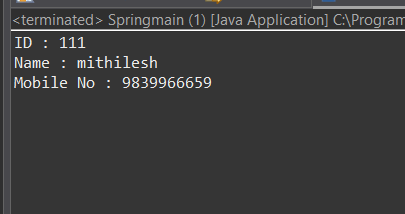

# Java-Based Configuration Project (Spring Framework)

## 📌 Project Overview
This project is a **Java-based configuration** example using the **Spring Framework**, where all configurations are done using **Java classes and annotations** instead of XML.

The project focuses on understanding how Spring manages beans, dependency injection, and application context using **pure Java configuration**.

---

## 🛠️ Technologies Used
- Java (Core Java)
- Spring Framework
- Java-Based Configuration
- Eclipse IDE
- JDK 8+
- Git & GitHub

---

## ✨ Features
- No XML configuration
- Annotation-based Spring configuration
- Clean and modular project structure
- Easy to understand for beginners
- Ideal for learning Spring Core concepts

---

## 📂 Project Structure

```text
spring-java-based-configuration
│
├── src
│   └── cs
│       ├── bean
│       │   └── Stud.java
│       │
│       ├── repo
│       │   └── Stdrepo.java
│       │
│       └── main
│           └── Springmain.java
│
├── screenshots
│   └── output.png
│
├── .settings
├── bin
├── .classpath
├── .project
├── .gitignore
└── README.md
```

---

## ⚙️ Java-Based Configuration
- Uses `@Configuration` and `@Bean`
- Uses `@ComponentScan`
- Dependency Injection using `@Autowired`
- ApplicationContext initialized using `AnnotationConfigApplicationContext`

---

## 🧪 Sample Configuration Code
```java
@Configuration
@ComponentScan(basePackages = "com.example")
public class AppConfig {

    @Bean
    public ServiceClass serviceClass() {
        return new ServiceClass();
    }
}
```
---

## ▶️ How to Clone & Run the Project
🔹 Clone Repository
```bash
git clone: https://github.com/your-username/java-based-configuration.git
```
---

🔹 Steps to Run

1. Open Eclipse IDE
2. Click File → Open Projects from File System
3. Select the cloned folder
4. Ensure JDK is configured
5. Run MainApp.java
6. Check output in console

---

## 🖼️ Screenshots

### 🔹 Console Output


---

## 🎯 Learning Outcomes

- Understanding Spring without XML
- Bean lifecycle using Java configuration
- Dependency Injection in Spring
- Clean project structuring

---

👨‍💻 Author

Mithilesh Kumar Mishra                                                                                                                                                                      
Java Developer | Spring Framework Learner

---

⭐ Support

If you found this project helpful, please ⭐ the repository to support my learning journey.
